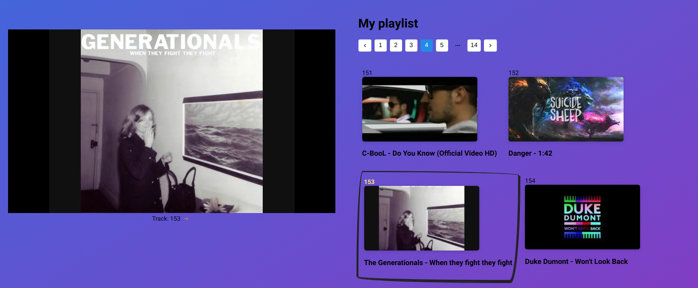

# Youtube-fast-playlist

<p align="center">
   <br/>
</p>

## About

App for quick access to youtube videos from your playlist

- move to the end of the playlist with a single click
- scroll to the currently playing track
- embedded youtube player
- after switching to the selected page the preceding pages are cached

example https://youtube-fast-playlist.vercel.app/?playlistId=PLPSk39C-ml8sAklFfKTlVJcGTpGiwugC4

## Requirements

.env.local

take a look on .env.example

## Getting Started

First, run the development server:

```bash
npm run dev
# or
yarn dev
```
